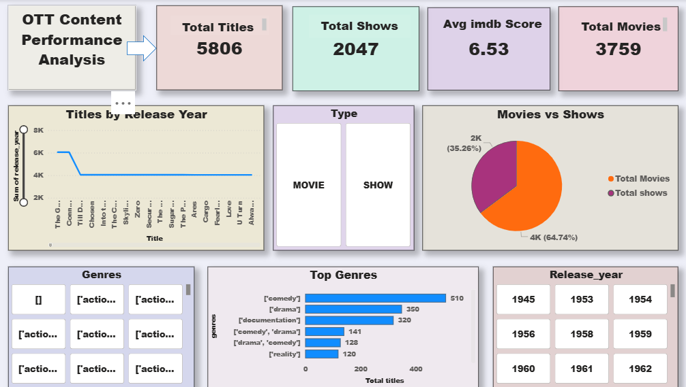

# Ott-content-analysis-powerbi
OTT Platform Content Analysis Dashboard using Power BI
# OTT Content Analysis Dashboard

## Project Overview
This project analyzes OTT platform content data to identify genre distribution, ratings trends, and country-wise content insights.

## Tools Used
- Power BI
- Excel

## Key KPIs
- Total Titles
- Genre Distribution
- Country-wise Content
- Ratings Analysis
- Release Year Trends

## Key Insights
- Drama and Comedy are most common genres
- Majority of content released after 2015
- Certain countries dominate content production

## 📊 Dashboard Preview

